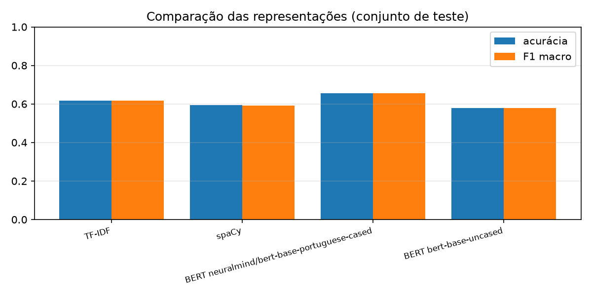
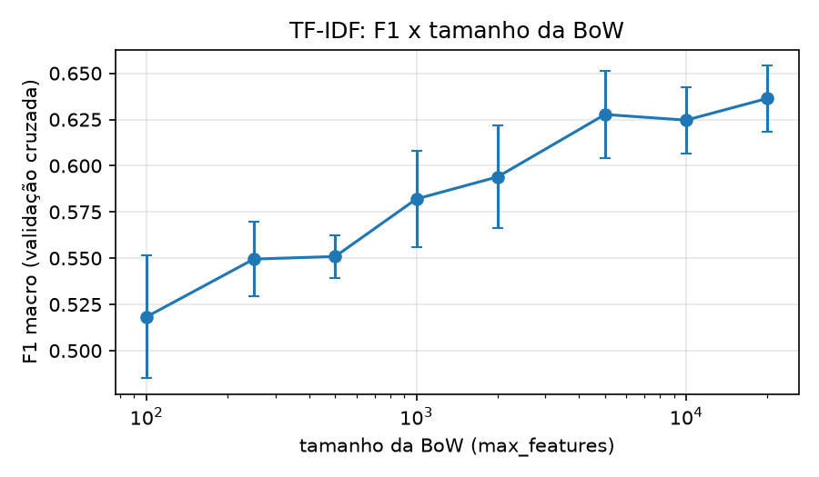

# Classificação de questões por subárea (item 3)

Classifica as questões do corpus em **redes**, **seguranca** ou **sistemas**, comparando três representações de texto: BoW + TF-IDF, embeddings do spaCy (`pt_core_news_lg`) e embeddings de BERT (BERTimbau e `bert-base-uncased`). Todas usam o mesmo split treino/teste (80/20, semente 42) e o mesmo classificador (regressão logística).

## Como rodar

```
uv sync                                    # instala as dependências do pyproject.toml (inclui o modelo pt_core_news_lg)
uv run python classificacao/classificar.py
```

O `uv sync` não instala `torch`/`transformers` (extra `bert`): eles só são necessários para **gerar** os embeddings de BERT,
e isso é feito no Colab (veja abaixo). Com os embeddings em `classificacao/cache/`, o script roda sem eles.
Para gerar localmente: `uv sync --extra bert`.

Os embeddings do BERT ficam salvos em `classificacao/cache/` (fora do git) para as próximas execuções serem rápidas.
O nome do arquivo inclui um hash dos textos: se o dataset mudar, o cache antigo não é reaproveitado.

## Sem GPU: gerar os embeddings no Google Colab

Gerar os embeddings de BERT é a parte pesada. Em computador sem GPU, use [`colab_embeddings.ipynb`](colab_embeddings.ipynb):

1. Abra o notebook no Colab (*Arquivo → Fazer upload de notebook*) e escolha uma GPU (T4).
2. Envie `dataset/questoes.jsonl`, `classificacao/preparar_dados.py` e `classificacao/embeddings_bert.py` (o repositório é privado).
3. Rode as células e baixe `cache_embeddings.zip`.
4. No seu computador: `unzip cache_embeddings.zip -d classificacao/` e rode o `classificar.py` normalmente.

## Arquivos

| arquivo | função |
|---|---|
| `classificar.py` | TF-IDF, spaCy e BERT: treina, avalia e compara |
| `preparar_dados.py` | carrega o dataset e monta o texto de cada questão (mesmo código local e no Colab) |
| `embeddings_bert.py` | gera/carrega os embeddings de BERT (pode ser rodado sozinho) |
| `colab_embeddings.ipynb` | roda `embeddings_bert.py` no Colab |

Nos itens certo/errado, o texto usa só o enunciado: as "alternativas" (Certo/Errado) vazariam a subárea, já que
esses itens não se distribuem igualmente entre elas.

## Resultados

Conjunto de **teste** de 300 questões (20% de 1500; 3 classes, então o acaso fica em 0,33):

| representação | acurácia | F1 macro | F1 na validação cruzada (desvio) |
|---|--:|--:|--:|
| BERT neuralmind/bert-base-portuguese-cased | 0.657 | 0.656 | 0.647 (0.024) |
| TF-IDF | 0.617 | 0.617 | 0.636 (0.018) |
| spaCy | 0.593 | 0.593 | 0.602 (0.024) |
| BERT bert-base-uncased | 0.580 | 0.579 | 0.609 (0.014) |

Ficam em `classificacao/resultados/`: tabela e gráfico de comparação (`comparacao.csv`, `comparacao.png`), matrizes de confusão, questões erradas por modelo, curva do F1 pelo tamanho da BoW e as palavras mais importantes de cada subárea no TF-IDF.



*Acurácia e F1 macro de cada representação no conjunto de teste (300 questões).*

BERTimbau obteve o melhor resultado (acurácia 0,657), significativamente acima do spaCy e do BERT em inglês (p < 0,05), mas sem diferença significativa em relação ao TF-IDF (0,617; p = 0,24). O BERT em inglês, mesmo sem ser treinado em português, ficou bem acima do acaso (0,58), o que sugere que o vocabulário técnico compartilhado entre os idiomas carrega muito sinal. As diferenças entre TF-IDF, spaCy e BERT em inglês não são significativas com 300 questões de teste, e todos os modelos ficam perto do teto imposto por rótulos ruidosos (o rótulo vem do concurso, não do assunto da questão).


Escolhemos o tamanho do BoW plotando os resultados e comparando os hiper-parâmetros:



*F1 macro (média e desvio da validação cruzada de 5 partes no treino) em função do tamanho da BoW (`max_features`), com os demais parâmetros fixos nos melhores valores.*

O F1 macro sobe rápido até cerca de 5.000 palavras (de 0,52 com 100 palavras para 0,63 com 5.000) e a partir daí atinge um platô: com 10.000 e 20.000 palavras fica entre 0,62 e 0,64, dentro de um desvio-padrão (cerca de 0,02) do valor de 5.000. Mantivemos 20.000, o valor escolhido pela busca em grade (validação cruzada só no treino), por ter a maior média (0,636). A diferença para 5.000 (0,628) está dentro do ruído, então 5.000 também seria defensável. Para checar se um vocabulário grande prejudicaria a generalização, comparamos os dois tamanhos, ainda só com dados de treino, também com a validação cruzada feita **por prova** (os exames de validação não aparecem no treino da rodada): 20.000 palavras deram F1 de 0,520 e 5.000 deram 0,505, outra vez dentro do ruído (desvio de cerca de 0,05). Ou seja, o vocabulário maior não piora a generalização para exames inéditos, e não há motivo para trocar o valor escolhido pela busca depois de ver os resultados. A mesma busca escolheu unigramas e bigramas (`ngram_range=(1, 2)`), `min_df=1` e `C=10`.