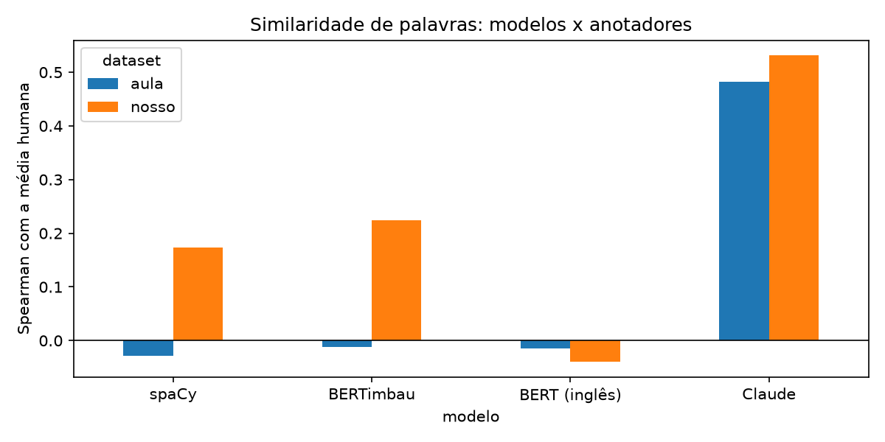

# Similaridade de palavras: comparação dos modelos (item 4)

Resumo da análise do item 4. O experimento completo, com código, gráficos e as maiores divergências de cada modelo,
está em [`topico_4/similaridade_modelos.ipynb`](topico_4/similaridade_modelos.ipynb) (seção 5). Os números saem de
[`topico_4/comparacao_modelos.csv`](topico_4/comparacao_modelos.csv).

> **Uso de IA.** O LLM avaliado é o Claude. As notas dele foram dadas às cegas, em uma sessão separada que só via os
> pares, sem as notas humanas (prompt em [`topico_4/claude/PROMPT.md`](topico_4/claude/PROMPT.md)). O Claude também
> ajudou a escrever o código e este texto, então quem lê deve ter isso em mente. Detalhes em [`../USO_DE_IA.md`](../USO_DE_IA.md).

## Datasets e modelos

| dataset | pares | escala | como os pares foram escolhidos |
|---|--:|---|---|
| nosso (`similaridade_final.csv`) | 100 | Likert 1–5 | sorteados entre os 200 lemas mais frequentes do corpus de questões |
| aula (`topico_4/dataset_aula.csv`) | 80 | 0–1 | escolhidos por serem próximos (sinônimos, quase sinônimos e conceitos vizinhos) |

| modelo | tipo | como mede a similaridade |
|---|---|---|
| spaCy `pt_core_news_lg` | estático | cosseno entre os vetores das duas palavras |
| BERTimbau (`neuralmind/bert-base-portuguese-cased`) | transformer | cosseno entre os vetores da palavra isolada (média dos sub-tokens, última camada) |
| `bert-base-uncased` | transformer | idem |
| Claude Opus 5.5 | LLM | recebe a mesma escala e as mesmas instruções dos anotadores e dá a nota |

Métrica: correlação de Spearman entre a nota do modelo e a média dos dois anotadores. O Spearman só olha a ordem dos
pares, então as escalas diferentes (cosseno, 1–5, 0–1) não atrapalham.

## Resultados

| modelo | nosso (100 pares) | aula (80 pares) |
|---|:-:|:-:|
| **Claude Opus 5.5** | **0,53** (p < 0,001) | **0,48** (p < 0,001) |
| BERTimbau | 0,22 (p = 0,03) | −0,01 (p = 0,92) |
| spaCy `pt_core_news_lg` | 0,17 (p = 0,09) | −0,03 (p = 0,81), 75 pares¹ |
| `bert-base-uncased` | −0,04 (p = 0,70) | −0,01 (p = 0,90) |
| *humanos (a1 x a2)* | *0,27* | *0,76* |
| *teto realista para um modelo²* | *≈ 0,65* | *≈ 0,93* |

¹ Cinco palavras do dataset da aula não têm vetor no spaCy (parsear, desalocar, deployar, versionar, tokenizar).

² A nota de comparação é a média de dois anotadores. Pela fórmula de Spearman-Brown, a confiabilidade dessa média é
2r/(1+r), em que r é a concordância entre os anotadores. Um modelo perfeito correlacionaria no máximo √(2r/(1+r)) com
ela: 0,65 no nosso dataset e 0,93 no da aula.

A ordem é a mesma nos dois datasets: **Claude > BERTimbau ≈ spaCy > BERT em inglês**. Só o Claude tem correlação
clara com os humanos nos dois. No dataset da aula, os três modelos de vetores ficam em zero. Em relação ao teto, o
Claude chega a uns 80% no nosso dataset e a uns 50% no da aula.

## Análise

**As duas referências humanas são diferentes.** No dataset da aula os anotadores concordam bastante (0,76) e quase
todos os pares são próximos: o desafio é separar "igual" de "parecido". No nosso, os pares foram sorteados e quase
nenhum tem relação (média humana de 1,5 em 5). A concordância é baixa (0,27) porque os anotadores usaram critérios
diferentes: a Gabriela anotou **similaridade de significado** e o Renato anotou **relação entre as palavras**
(código–proteção recebeu 1 e 5). Por isso as diferenças pequenas entre modelos no nosso dataset não são
interpretáveis.

**spaCy (estático).** O cosseno mede **co-ocorrência em texto geral**, não sinonímia nem relação dentro de TI:
- Pares que só são próximos na área ficam com cosseno baixo (código–proteção 0,19, host–comando 0,21).
- Palavras abstratas e frequentes ficam próximas sem ter o mesmo sentido (operacional–utilização 0,67).
- No dataset da aula falham os anglicismos e termos técnicos: thread–fluxo, iteração–loop e kernel–núcleo são
  sinônimos para os humanos, mas ficam entre 0,19 e 0,30.
- O spaCy separa os dois datasets como um todo (cosseno médio de 0,31 nos pares sorteados contra 0,50 nos pares da
  aula). Mas não ordena os pares **dentro** do dataset da aula, que é o que a tarefa pede.

**BERT (transformer).** O BERTimbau é o melhor modelo de vetores no nosso dataset (0,22), mas fica em zero no da
aula:
- Os cossenos ficam em uma faixa estreita e alta. A média nos pares sorteados (0,62) é **maior** que nos pares
  similares da aula (0,58).
- É o efeito da **anisotropia**: os vetores do BERT apontam mais ou menos para a mesma direção, então o cosseno diz
  pouco.
- Além disso, o BERT foi treinado para representar palavras em frases. Com a palavra sozinha, o vetor reflete mais a
  forma e os sub-tokens do que o sentido.

**O `bert-base-uncased`** fica em zero nos dois datasets. Ele foi treinado só em inglês e quebra as palavras em
português em pedaços sem sentido: "criptografar" vira `cr ##ip ##to ##gra ##far`, e no BERTimbau vira
`cripto ##graf ##ar`. O idioma do modelo importa mais do que a arquitetura.

**Claude (LLM).** É o único que funciona nos dois datasets:
- Ele recebe em linguagem natural **o critério** do que é "similar" e a mesma escala dos anotadores. Os modelos de
  vetores só calculam uma distância e não têm como saber que critério usar.
- No nosso dataset ele seguiu a similaridade de significado. Deu 1 para código–proteção e host–comando, que o Renato
  avaliou com 5, e é daí que vêm as suas maiores divergências com a média.
- No dataset da aula é mais rigoroso que os humanos: deu 0,5 para versionar–comitar e memória–armazenamento, que os
  humanos avaliaram com 1.
- Mesmo sendo o melhor, fica longe da concordância humana nesse dataset (0,48 contra 0,76).

## Conclusão

Medir similaridade de palavras com **cosseno entre vetores** funcionou mal com os dois tipos de modelo testados. Os
vetores estáticos medem co-ocorrência em texto geral, e o BERT com a palavra isolada gera vetores pouco informativos.
Os dois falham principalmente quando é preciso separar graus de similaridade entre pares que já são próximos, como
no dataset da aula. O LLM consegue fazer isso porque recebe o critério da anotação, e foi o único com correlação clara
(p < 0,001) nos dois datasets.

## Limitações

- **Referência ruidosa no nosso dataset.** Com concordância humana de 0,27 e critérios diferentes entre os
  anotadores, só as diferenças grandes (LLM contra os demais) são confiáveis.
- **Tamanho.** Com 80 a 100 pares, diferenças como a entre spaCy e BERTimbau no nosso dataset não são significativas.
- **Empates.** As notas do Claude e dos humanos são discretas (70 dos 100 pares do nosso dataset receberam 1 do
  Claude), o que limita o Spearman.
- **Reprodutibilidade do LLM.** As notas vieram de sessões de conversa, registradas em `topico_4/claude/`, e não de
  uma chamada por script. Podem mudar de uma sessão para outra.
- **Gemini.** Também foi testado pela API gratuita, mas respondeu 503 (sobrecarregado) e ficou fora da comparação.
